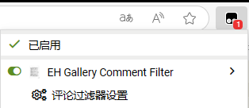
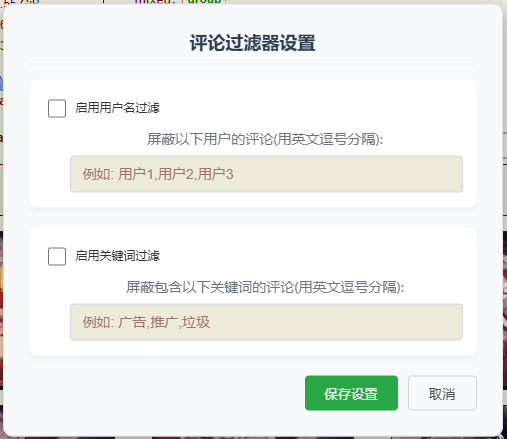

# EH Gallery 评论过滤器

一款用于过滤 E-Hentai/ExHentai 画廊页面评论的用户脚本。

## 功能
- 隐藏指定用户的评论
- 隐藏包含关键词的评论
- 可自定义过滤规则并保存设置

## 安装方法
1. 首先安装用户脚本管理器：
   - [Tampermonkey](https://www.tampermonkey.net/) (推荐)
   - [Violentmonkey](https://violentmonkey.github.io/)
2. [点此进入脚本页]([https://www.tampermonkey.net/](https://github.com/WWWA7/EH-GalleryCommentFilter/blob/main/EH%20Gallery%20Comment%20Filter-1.0.user.js))
   点击脚本页面的"Raw"按钮安装
4. 刷新 E-Hentai/ExHentai 页面

## 使用说明
1. 进入任意 E-Hentai/ExHentai 画廊页面：
2. 点击浏览器工具栏中的用户脚本管理器图标
3. 选择"评论过滤器设置"菜单项

5. 在设置面板中：
   - 启用"用户名过滤"并输入要屏蔽的用户名(多个用逗号分隔)
   - 启用"关键词过滤"并输入要屏蔽的关键词(多个用逗号分隔)

6. 点击"保存设置"应用过滤规则

## 其他事项
- 设置会自动保存，下次访问无需重新配置
- 新加载的评论也会实时过滤
- 取消勾选启用选项可临时关闭过滤功能
- 可使用通配符(*)进行模糊匹配
- 关键词不区分大小写

